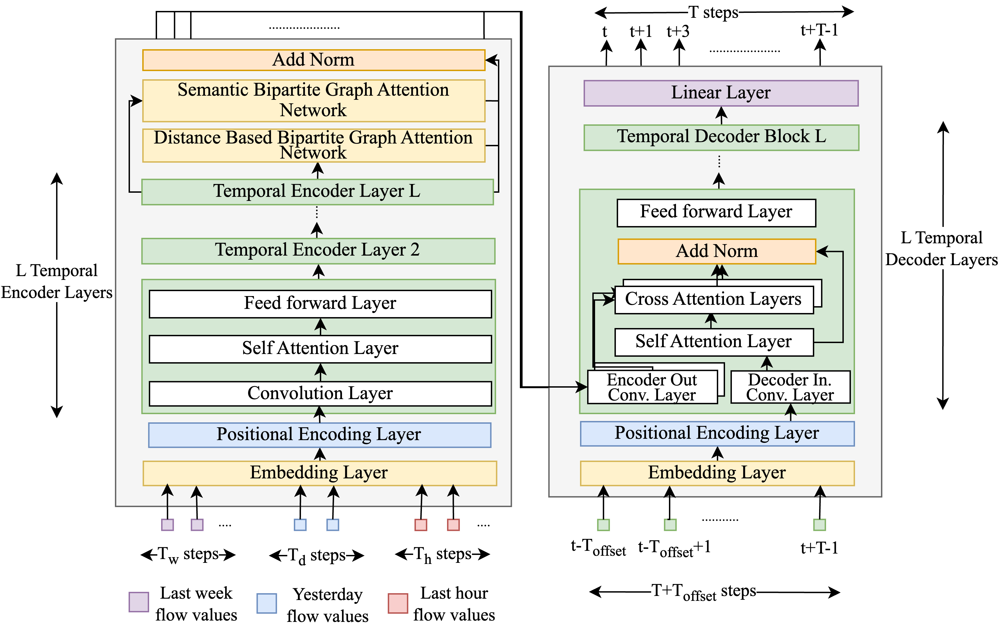

# Spatial-Temporal Bipartite Graph Attention Network for Traffic Forecasting (STBGAT)

This is the Pytorch implementation of the paper [Spatial-Temporal Bipartite Graph Attention Network for Traffic Forecasting](https://www.google.com/) published at PAKDD'24

## Architecture


## Setup
We used python 3.10.11 and Pytorch 1.13.1 for the implementation.<br>
Use the requirement file to create a new conda environment.

```shell
conda create -n stbgat python=3.10.11
conda activate stbgat
pip install -r requirements.txt
```

## Training
We included the config files for PEMS04, PEMS07 and PEMS08 datasets (Checkout relevant branch).<br>
Before training it's important to checkout to the correct branch and use the correct config file.<br>
To train the model, use the following command.
```shell
python main.py
```

## Evaluation
You can download the pretrained models from [Google Drive](www.google.com)
To evaluate the model, use the following command.
```shell
python evaluate.py
```
